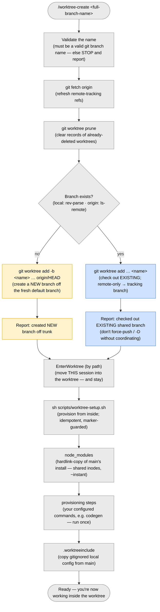

# `/worktree-create` — create a worktree for a branch

> Part of [worktree-per-issue](../README.md). Creates a git worktree under
> `.claude/worktrees/` for a branch, new **or** existing.

Run `/worktree-create` from your **primary checkout**. One command handles both a new
branch and an existing one — git itself forces which (you can't create a branch that
already exists, nor check out one that doesn't), so nothing is guessed. Always pass
the FULL branch name:

- **Branch does not exist** (local or origin) → it creates the branch **new**, based
  on freshly-fetched trunk, so a dirty or stale main window can't affect the base.
- **Branch exists** → it checks the branch out (a remote-only branch becomes a local
  tracking branch). This is often a colleague's shared branch — see
  [Shared branches](worktree-remove.md#shared-branches).

`/worktree-create` always **reports which action it took and why**, so a typo
(creating a stray branch) or a name collision (landing on someone else's branch) is
obvious right away. Then it **moves you into** the worktree so you can start working.

That move gives your current session **code** isolation. To work on a **different**
issue in parallel with its own **context** isolation, open a separate Claude session
in that worktree folder:

```sh
cd .claude/worktrees/<flat>
claude                 # a fresh, isolated Claude context for another issue
```

Any way of starting Claude in that folder works. The sibling
[vscode-claude-tabs](../../vscode-claude-tabs/) tool is one convenience for this (a
`Ctrl+Alt+W` "Claude tab per worktree" keybinding), but it is fully optional — this
tool does not depend on it.



Setup after creation (`node_modules`, your setup steps, `.worktreeinclude`) is
described in [What the automatic setup does](../README.md#what-the-automatic-setup-does).

## Pushing

From the worktree, push a NEW branch with `git push -u origin HEAD` (creates it on the
remote). An EXISTING branch pushes with plain `git push` (tracking is already set).
Add a `.husky/pre-push` hook if you want a guard (e.g. `check:deps`).
