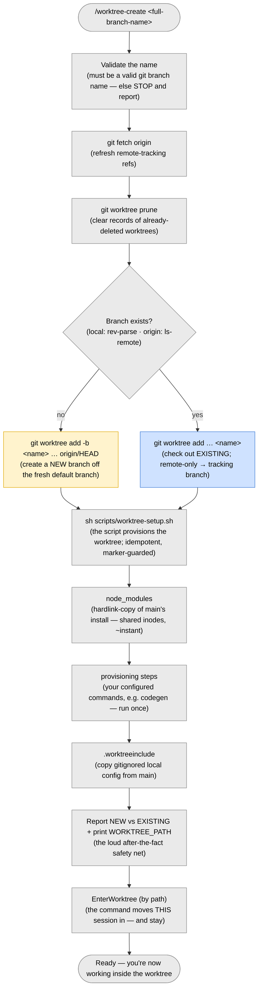

# `/worktree-create` — create a worktree for a branch

> Part of [worktree-per-issue](../README.md). Creates a git worktree under
> `.claude/worktrees/` for a branch, new **or** existing, and moves you into it.

The command is a thin wrapper: it runs `scripts/worktree-create.sh` (installed from
`template/scripts/worktree-create.sh`), which validates the name, fetches, resolves
new-vs-existing (git decides — nothing is guessed), creates the worktree and provisions
it, then prints `WORKTREE_PATH=<path>`. The one part a script can't do — relocating the
session into the worktree — stays with Claude: the command reads that path and calls
`EnterWorktree`.

## Flow

Full flow, the new-vs-existing rules, and the diagram:
[Creating a worktree](../template/docs/worktrees.md#creating-a-worktree-worktree-create).
Pushing from the worktree: [Pushing](../template/docs/worktrees.md#pushing).
