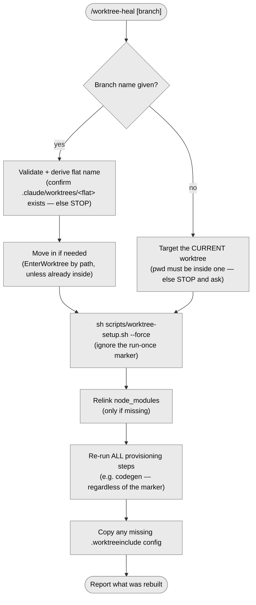

# `/worktree-heal` — heal a broken worktree

> Part of [worktree-per-issue](../README.md). Rebuilds a worktree's setup in place.

If a worktree is broken or stale (missing generated files, drifted deps),
`/worktree-heal [branch]` re-runs `scripts/worktree-setup.sh --force` in it. Omit the
name to heal the current one.

`--force` ignores the run-once marker, so it re-runs **all** setup steps regardless of
whether they ran before (see
[What the automatic setup does](../README.md#what-the-automatic-setup-does)).

