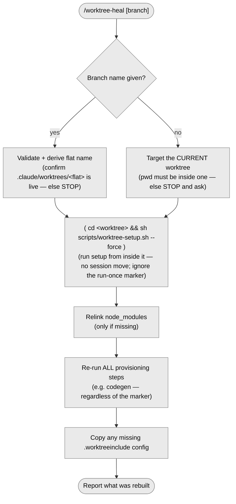

# `/worktree-heal` — heal a broken worktree

> Part of [worktree-per-issue](../README.md). Rebuilds a worktree's setup in place when
> it's broken or stale (missing generated files, drifted deps).

The command is a thin wrapper: it runs `scripts/worktree-heal.sh` (installed from
`template/scripts/worktree-heal.sh`) and relays its output. The script locates the target
worktree (from the branch name, or the current one if none is given) and force-re-runs
`scripts/worktree-setup.sh --force` inside it — `--force` ignores the run-once marker so
**all** setup steps run again.

## Flow

Full flow and the diagram:
[Healing a worktree](../template/docs/worktrees.md#healing-a-worktree-worktree-heal).
What the setup rebuilds:
[What the automatic setup does](../template/docs/worktrees.md#what-the-automatic-setup-does).
