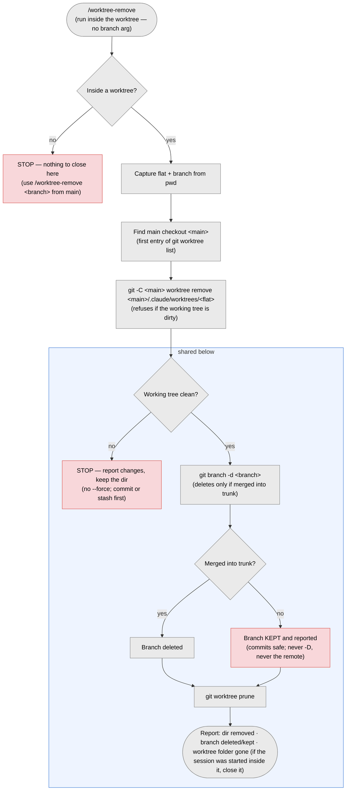
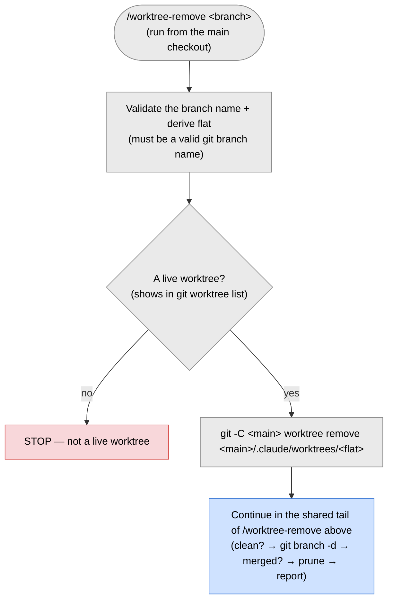

# `/worktree-remove` — close a worktree

> Part of [worktree-per-issue](../README.md). Removes a worktree and, if the branch is
> safely merged, deletes it too.

The command is a thin wrapper: it runs `scripts/worktree-remove.sh` (installed from
`template/scripts/worktree-remove.sh`) and relays its output. The script re-execs the main
checkout's copy of itself before removing anything, so the running script never sits inside
the directory being deleted (matters on Windows, where an open file blocks its own removal).
Removal always runs against the main checkout via `git -C`, so it works from anywhere and
never needs `ExitWorktree`.

## From inside the worktree — `/worktree-remove`

## From the main checkout — `/worktree-remove <branch>`

Full flow (both modes), the never-`--force`/never-`-D` safety rules, the
manual fallback, and the shared-branch caution: [Cleanup](../template/docs/worktrees.md#cleanup).
