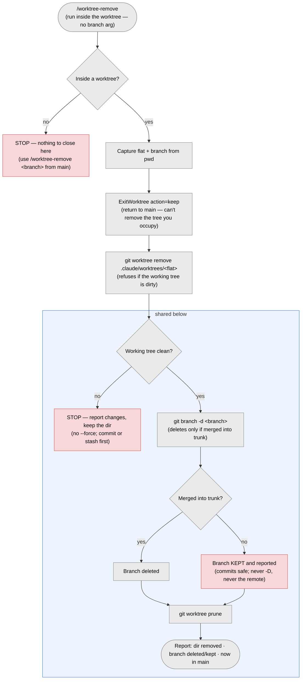
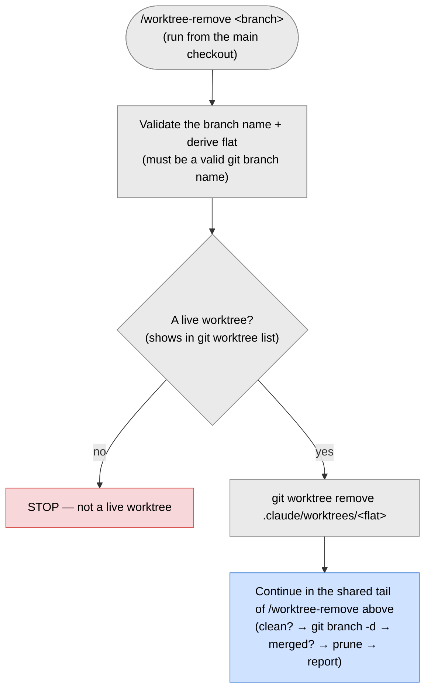

# `/worktree-remove` — close a worktree

> Part of [worktree-per-issue](../README.md). Removes a worktree and, if safe,
> deletes its branch.

Claude's native worktree auto-cleanup does not apply here — `ExitWorktree` won't
remove a worktree created with `git worktree add` and entered by path, so it's a
no-op on ours (by design). Closing is explicit.

`/worktree-remove` has two modes, chosen by where you run it:

- **inside a worktree** — run `/worktree-remove` (no argument) to close _that_ one. It
  steps back to main first (git won't remove the tree you're in).
- **from the main checkout** — run `/worktree-remove <branch>` to close a named one.

The wrong combination (an argument inside a worktree, or none from main) stops with a
hint. It runs `git worktree remove` (refuses if the worktree is dirty), then
`git branch -d`, which deletes the branch **only if it's merged into your trunk**. An
unmerged branch is kept and reported, so no commits are ever lost. It never
force-removes, never uses `git branch -D`, and never touches the remote.

## From inside the worktree — `/worktree-remove`



## From the main checkout — `/worktree-remove <branch>`



## Automatic prune (safe)

`/worktree-create` (and the setup script when run from main) runs `git worktree
prune`, which only removes records for folders that are **already gone** — never a
live worktree or a branch. So a folder you delete by hand clears its stale `git
worktree list` entry next time. You can also run it yourself.

## Manual fallback

The same steps by hand:

```sh
git worktree list                                 # review worktrees + their branches
git worktree remove .claude/worktrees/<flat>      # drop a finished worktree's dir (refuses if dirty)
git branch --merged main                          # branches fully merged into trunk — safe to delete
git branch -d feature/<initials>/<ISSUE>/<slug>   # -d refuses to delete anything unmerged
```

Use `git worktree remove --force` only when the uncommitted changes can be thrown
away, and `git branch -D` only for an unmerged branch you know you don't need.

## Shared branches

A worktree checked out from an existing branch is often on a colleague's branch. `git
branch -d` (and `/worktree-remove`) only delete your **local** copy and never touch
the remote. Still, never force-push or `git branch -D` someone else's branch without
asking first.
