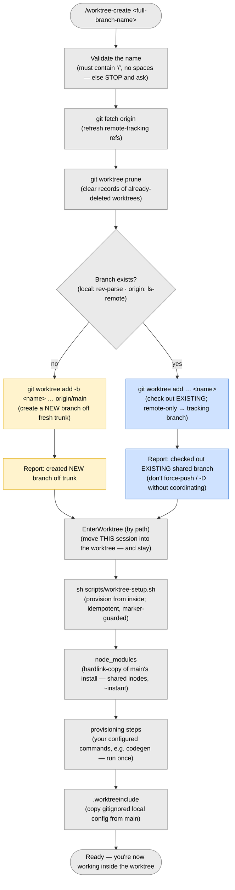
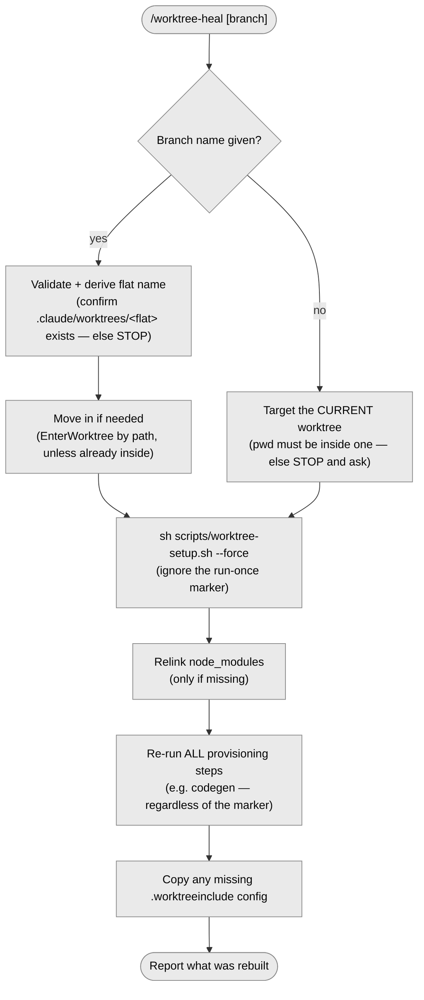
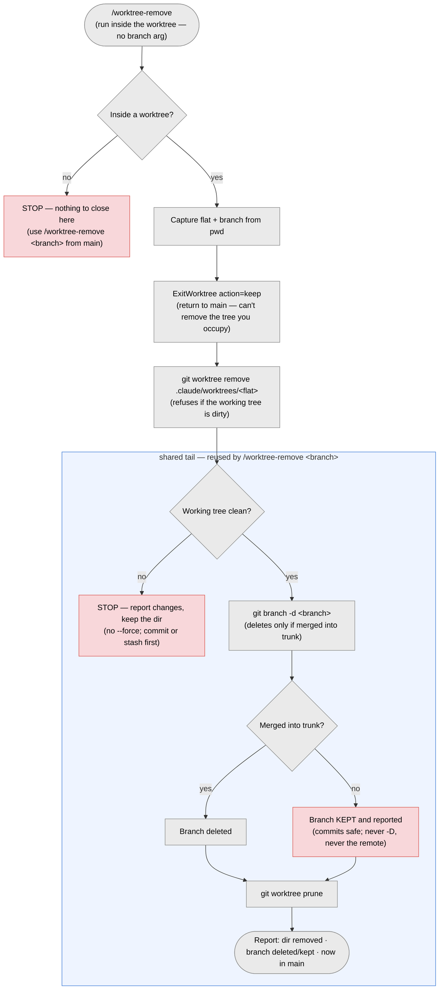
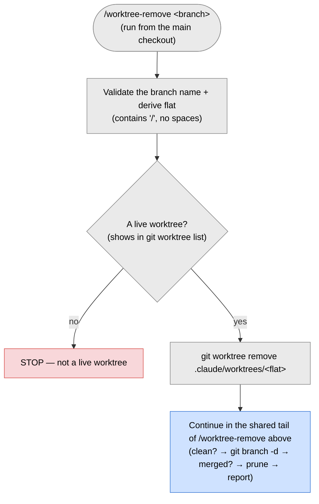

# Worktree-per-issue flow

We keep **one worktree per issue** so you (and agents) can work on several things at once without stashing or switching
branches in your main checkout. The flow rests on two independent kinds of isolation, each delivered by the right tool:

- **Code isolation → a git worktree.** A second working folder that shares the same `.git` but sits on its own branch.
  Pure git. Created for you by the `/worktree-create` command.
- **Context isolation → a separate Claude session.** A fresh Claude conversation opened _in_ the worktree folder, so
  parallel work never shares one context window. This is a thing _you_ do after the worktree exists — see
  [Working in a worktree](#working-in-a-worktree).

> Note on Claude's built-in "worktree" feature: `EnterWorktree` relocates the **current** session's working directory
> into a folder — same conversation, so it is _not_ context isolation. We use it only for convenience: after `/worktree-create`
> creates the worktree (with plain git), it moves you into it so you can start working immediately. Context isolation —
> a genuinely separate context for parallel work — still means a separate Claude session.

Worktrees live under `.claude/worktrees/<flat>/` (gitignored).

## Setup (once per clone)

```sh
{{PM_INSTALL}}            # connects the husky post-checkout hook
```

That is the whole setup. The commands, the hook, `scripts/worktree-setup.sh`, and `.worktreeinclude` are all committed,
so they work right after you clone. `{{PM_INSTALL}}` only wires the `post-checkout` git hook — a convenience for a
bare-CLI `git worktree add`. It is optional: the Claude `/worktree-create` and `/worktree-heal` commands run `scripts/worktree-setup.sh`
explicitly, so provisioning works with or without husky.

## Creating a worktree: `/worktree-create`

One command handles **both** a new branch and an existing one — git itself forces which, so nothing is guessed (you
cannot create a branch that already exists, nor check out one that does not). Run it from your **primary checkout** and
always pass the FULL branch name:

```text
/worktree-create feature/abc/TICKET-123/some-slug
```

- **Branch does not exist** (local or on origin) → `/worktree-create` creates it **new**, based on freshly-fetched trunk — so a dirty
  or out-of-date main window cannot poison the base.
- **Branch exists** → `/worktree-create` checks it out (a remote-only branch becomes a local tracking branch). This is often a
  colleague's shared branch: **never force-push or `git branch -D` it without coordinating.**

`/worktree-create` always **reports which action it took and why**, so a typo (silently creating a stray new branch) or a name
collision (silently landing on someone else's) is obvious immediately. It then **moves you into** the worktree so you
can start working right away.

The worktree directory is `.claude/worktrees/<flat>`, where `<flat>` is the branch name with every `/` replaced by `+`
(e.g. `feature+abc+TICKET-123+some-slug`). The folder name never changes; the branch keeps real `/` separators.

## Working in a worktree

`/worktree-create` **moves you into** the new worktree automatically (via `EnterWorktree`), so you can start working the moment it
returns — no manual step. You have **code** isolation (the worktree's own dir + branch) in your current session.

To work on a **different** issue in parallel with its own **context** isolation, open a _separate_ Claude session in
that issue's worktree folder:

```sh
cd .claude/worktrees/<flat>
claude                 # a fresh, isolated Claude context for another issue
```

Any way of starting Claude in that folder works (a new terminal, a new IDE window, or a per-worktree editor tab). The
sibling `vscode-claude-tabs` tool is one optional convenience for this (a `Ctrl+Alt+W` "Claude tab per worktree"
keybinding), but this toolbox does not depend on it — and it is not needed to work on the worktree `/worktree-create` just dropped you
into.



## Healing a worktree: `/worktree-heal`

If a worktree is broken or stale (missing generated files, a half-finished setup, drifted codegen), run
`/worktree-heal [branch]` to force-re-run its setup. Omit the branch name to heal the worktree you are currently in.



## What the automatic setup does

Once the worktree exists on disk, `scripts/worktree-setup.sh` provisions it — from `/worktree-create`'s **Provision** step, or from
`.husky/post-checkout` on a bare-CLI `git worktree add`. It is idempotent (a fast no-op once provisioned):

- **`node_modules`** is a hardlink-copy of the main checkout's install: a real directory whose files share inodes with
  main, so it is near-instant and adds almost no disk. If a branch needs different dependencies, run `{{PM_INSTALL}}`
  inside the worktree — it isolates automatically (packages are replaced by atomic rename, so the main tree is never
  mutated). Falls back to a full copy (cross-filesystem / Windows), then a real install.
- **Configured provisioning steps** run next — the commands you chose at install time (e.g. a codegen step). They run
  once: a marker (`node_modules/.wt-provisioned`) records that the worktree is provisioned, so a repeat trigger is a
  no-op. `/worktree-heal` passes `--force` to re-run them regardless.
- **`.worktreeinclude` config** — the gitignored files you listed are copied from the main checkout into the worktree.
  Plain `git worktree add` does **not** honor Claude's `.worktreeinclude`, so the script does the copy itself.

**Triggers.** `.husky/post-checkout` fires on `git worktree add`. The script is guarded by location: inside a worktree it
does the setup above; in the **main checkout** it only runs `git worktree prune`.

### Project-specific sibling links

If your project imports a sibling repo through a relative path (a shared library, design system, or knowledge base that
lives next to this repo), link it in from every worktree by editing the marked block in `scripts/worktree-setup.sh`
(`# --- project-specific sibling links (edit me) ---`). It ships commented out with a `make_junction` example. This is
intentionally not configured by the installer, because sibling layouts vary per team.

## Reporting work

To leave a standalone summary of what was done in a worktree (for a reviewer, or a session that resumes the work later),
use the sibling [`work-report`](https://github.com/pilniczek/worktree-toolbox/tree/main/work-report) tool: its
`/work-report` command writes a single `WORK-REPORT.md` at the working tree's root. It is a separate, optional install —
this toolbox does not depend on it, and `work-report` itself works in any repo, worktree or not.

## Pushing

- **New branch:** `git push -u origin HEAD` — creates `<name>` on the remote with the exact name.
- **Existing branch:** `git push` — tracking is already set; updates the shared branch.

## Cleanup

Nothing here uses Claude's native worktree auto-cleanup — `ExitWorktree` will not remove a worktree created with
`git worktree add` and entered by path, so it is a no-op on ours (by design). Closing is explicit.

**Close a worktree — `/worktree-remove`.** The normal way to finish, in two modes chosen by where you run it:
**inside a worktree**, run `/worktree-remove` (no argument) to close _that_ one — it steps back to main first (git won't
remove the tree you occupy); **from the main checkout**, run `/worktree-remove <branch>` to close a named one. The wrong
combination (an argument inside a worktree, or none from main) stops with a hint. It runs `git worktree remove` (refuses
if the worktree is dirty) then `git branch -d`, which
deletes the branch **only if it is merged into your trunk** — an unmerged branch is kept and reported, so no commits are
ever lost. It never force-removes, never uses `git branch -D`, and never touches the remote.

**From inside the worktree — `/worktree-remove`:**



**From the main checkout — `/worktree-remove <branch>`:**



**Automatic prune (safe).** The `/worktree-create` preflight (and the setup script when run from the main checkout) runs
`git worktree prune`, which only removes records for folders that are **already gone** — never a live worktree or a
branch. So a folder deleted by hand clears its stale `git worktree list` entry next time.

**Manual fallback.** The same steps by hand:

```sh
git worktree list                                  # review worktrees + their branches
git worktree remove .claude/worktrees/<flat>       # drop a finished worktree's dir (refuses if dirty)
git branch --merged main                           # branches fully merged into trunk — safe to delete
git branch -d feature/<initials>/<TICKET>/<slug>   # -d refuses to delete anything unmerged
```

Use `git worktree remove --force` only when the uncommitted changes can be thrown away, and `git branch -D` only for an
unmerged branch you know you do not need.

**Shared branches.** A worktree checked out from an existing branch often sits on a colleague's branch. `git branch -d`
(and `/worktree-remove`) only delete your **local** copy and never touch the remote — but never force-push or `git branch -D`
someone else's branch without asking first.

## Maintaining the commands (`/worktree-create`, `/worktree-heal`, `/worktree-remove`)

`/worktree-create`, `/worktree-heal`, and `/worktree-remove` share behavior (Validation, the flat-name rule, the worktree setup, and the code-vs-context
isolation note). To avoid copies, the shared parts live in **one** file: `.claude/worktree-shared.md`. Each command keeps
only its own steps and pulls in the shared block at the bottom. **Edit shared behavior in `.claude/worktree-shared.md`
once** —
never copy it back into the command files.

### Why `` !`cat …` `` and not `@import`

The include is `` !`cat "${CLAUDE_PROJECT_DIR:-.}/.claude/worktree-shared.md"` `` and not the `@path/to/file` form used
in `CLAUDE.md`. This is because the two file types use different templating engines:

|                     | `CLAUDE.md` (memory file)                                            | `.claude/commands/*.md` (command)                                        |
| ------------------- | -------------------------------------------------------------------- | ------------------------------------------------------------------------ |
| Inline another file | `@path/to/file` (importer, resolves relative to the file, recursive) | `` !`cat path` `` (runs the shell command at invocation, splices stdout) |
| Other substitutions | —                                                                    | `$ARGUMENTS`, `$1`, `$2`                                                 |

The `@`-import only works in memory files. Command files do not go through the importer, so a plain
`@../worktree-shared.md` there stays as literal text. The way a command file inlines another file is `` !`shell` ``
dynamic injection — so we use `cat`. This has two effects:

- The command's frontmatter must allow `Bash(cat:*)`, because the `!` form really runs a shell command.
- We anchor the path with `${CLAUDE_PROJECT_DIR:-.}`. Claude Code sets `CLAUDE_PROJECT_DIR` to the repo root at
  invocation, and it falls back to the current folder (the primary checkout, where `/worktree-create` and `/worktree-heal` run) if it is not set.

`.claude/worktree-shared.md` lives **outside** `.claude/commands/` on purpose, so it is never registered as its own
callable slash command.
